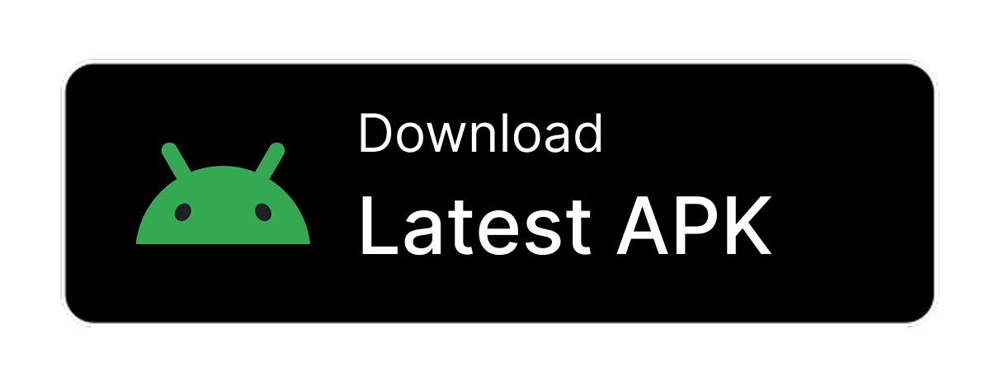
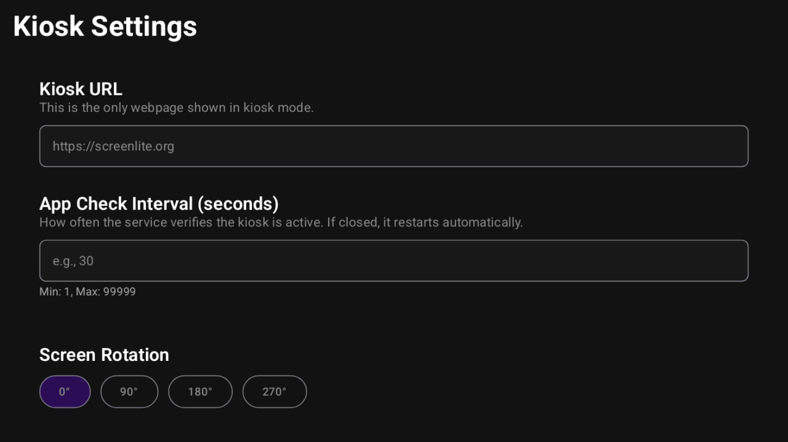

# Screenlite Web Kiosk

A simple Android kiosk browser app that displays web content in full-screen mode.

## Key Features
- Displays any website in immersive full-screen mode
- Automatically launches on device boot
- Brings itself back to the foreground if minimized
- Clicking and scrolling are disabled in WebView on TV
- Supports website rotation (0°, 90°, 180°, 270°), even if the device doesn’t support orientation changes
- Automatic retry mechanism with exponential backoff for network failures
- Automatically injects responsive viewport meta tags
- Special UI adaptations for Android TV devices
- Hides system bars and navigation elements
- Prevents device from going to sleep
- Real-time network connectivity monitoring
- Error handling with user-friendly messages
- Compatible with both Android TV and mobile devices

If you find a bug, please open a GitHub issue and include logcat logs if possible.

## Usage Instructions

1. Install the APK on your Android device.  
2. Grant the **Display over other apps** permission to Screenlite Web Kiosk.  
3. Launch the app.  
4. Access settings by tapping the screen 5 times quickly in the bottom-left corner on a mobile device, or by pressing the center button (OK) on a TV remote.  
5. Enter the website URL you want to display.  
6. Set the app visibility check interval (recommended 5–10 seconds). If you need time to configure the device, set a higher number.
7. Choose screen rotation if needed.  
8. Save your settings; the app will restart with the new configuration.

## Requirements

### Minimum Android Version
- **Android 8.0 (API Level 26)** or higher  
- **Target SDK**: 36 (Android 14+)
 
Experimental support for Android 5.1 (API Level 22) and above is available, but functionality may be limited or unstable.

### Hardware Requirements
- **Touchscreen**: Optional (supports both touch and non-touch devices)  
- **Android TV**: Supported with leanback launcher integration  
- **Network**: Internet connectivity required for web content

## Permissions

- **RECEIVE_BOOT_COMPLETED**: Allows the app to start automatically when the device boots  
- **FOREGROUND_SERVICE**: Required for the StayOnTopService to run in the background  
- **FOREGROUND_SERVICE_SPECIAL_USE**: Special use case for kiosk applications  
- **WAKE_LOCK**: Prevents the screen from turning off  
- **SYSTEM_ALERT_WINDOW**: Allows the app to draw over other apps (kiosk mode)  
- **INTERNET**: Required to load web content  
- **ACCESS_NETWORK_STATE**: Monitors network connectivity for error handling

## Configuration

### Settings Available
1. **Kiosk URL**: The website to display (default: https://screenlite.org)  
2. **Check Interval**: How often the service verifies the app is active (1-99999 seconds, default: 10)  
3. **Screen Rotation**: Display rotation angle (0°, 90°, 180°, 270°)

### Accessing Settings
- **Mobile/Touch Devices**: Tap 5 times in the bottom-left corner of the screen within 2 seconds
- **Android TV**: Use the center button on the remote 5 times within 2 seconds  

## Application Lifecycle
1. **Boot**: BootReceiver starts StayOnTopService automatically  
2. **Service**: StayOnTopService runs as foreground service with configurable check interval  
3. **Main Activity**: Displays web content in full-screen immersive mode  
4. **Monitoring**: Service continuously monitors if the app is visible and brings it to front if needed  

## Attribution

Android is a trademark of Google LLC. The Android robot is reproduced or modified from work created and shared by Google and used according to terms described in the [Creative Commons 3.0 Attribution License](https://creativecommons.org/licenses/by/3.0/).